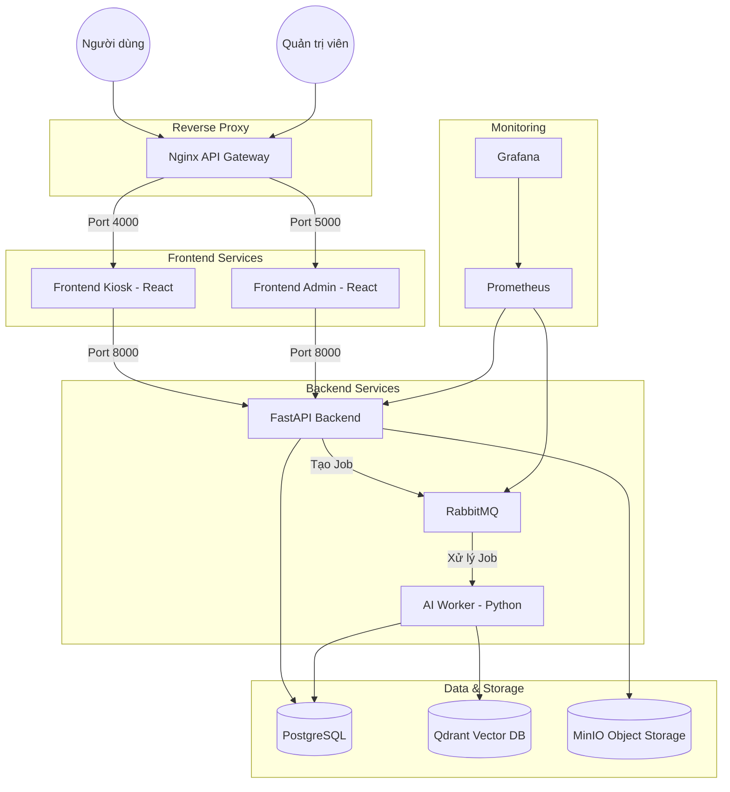
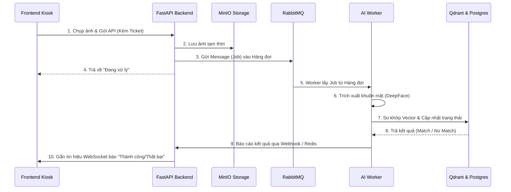

# Kiến Trúc Hệ Thống (System Architecture)

## 1. Sơ đồ Triển khai (Deployment Diagram)    
    

```mermaid
graph TD
    User((Người dùng)) --> Nginx
    Admin((Quản trị viên)) --> Nginx
    
    subgraph Reverse Proxy
        Nginx[Nginx API Gateway]
    end
    
    subgraph Frontend Services
        Nginx --> |Port 4000| Kiosk[Frontend Kiosk - React]
        Nginx --> |Port 5000| AdminUI[Frontend Admin - React]
    end
    
    subgraph Backend Services
        Kiosk --> |Port 8000| API[FastAPI Backend]
        AdminUI --> |Port 8000| API
        API --> |Tạo Job| MQ[RabbitMQ]
        MQ --> |Xử lý Job| Worker[AI Worker - Python]
    end
    
    subgraph Data & Storage
        API --> PG[(PostgreSQL)]
        Worker --> PG
        Worker --> QD[(Qdrant Vector DB)]
        API --> MI[(MinIO Object Storage)]
    end
    
    subgraph Monitoring
        Prometheus --> API
        Prometheus --> MQ
        Grafana --> Prometheus
    end
```

## 2.Sơ đồ Luồng hoạt động (Sequence Diagram)

```mermaid
sequenceDiagram
    participant Kiosk as Frontend Kiosk
    participant API as FastAPI Backend
    participant MinIO as MinIO Storage
    participant MQ as RabbitMQ
    participant Worker as AI Worker
    participant DB as Qdrant & Postgres

    Kiosk->>API: 1. Chụp ảnh & Gửi API (Kèm Ticket)
    API->>MinIO: 2. Lưu ảnh tạm thời
    API->>MQ: 3. Gửi Message (Job) vào Hàng đợi
    API-->>Kiosk: 4. Trả về "Đang xử lý"
    MQ->>Worker: 5. Worker lấy Job từ Hàng đợi
    Worker->>Worker: 6. Trích xuất khuôn mặt (DeepFace)
    Worker->>DB: 7. So khớp Vector & Cập nhật trạng thái
    DB-->>Worker: 8. Trả kết quả (Match / No Match)
    Worker->>API: 9. Báo cáo kết quả qua Webhook / Redis
    API->>Kiosk: 10. Gắn tín hiệu WebSocket báo "Thành công/Thất bại"
```
